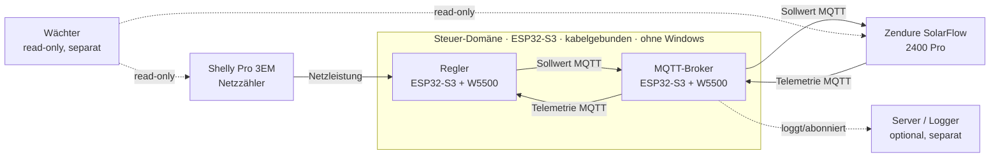
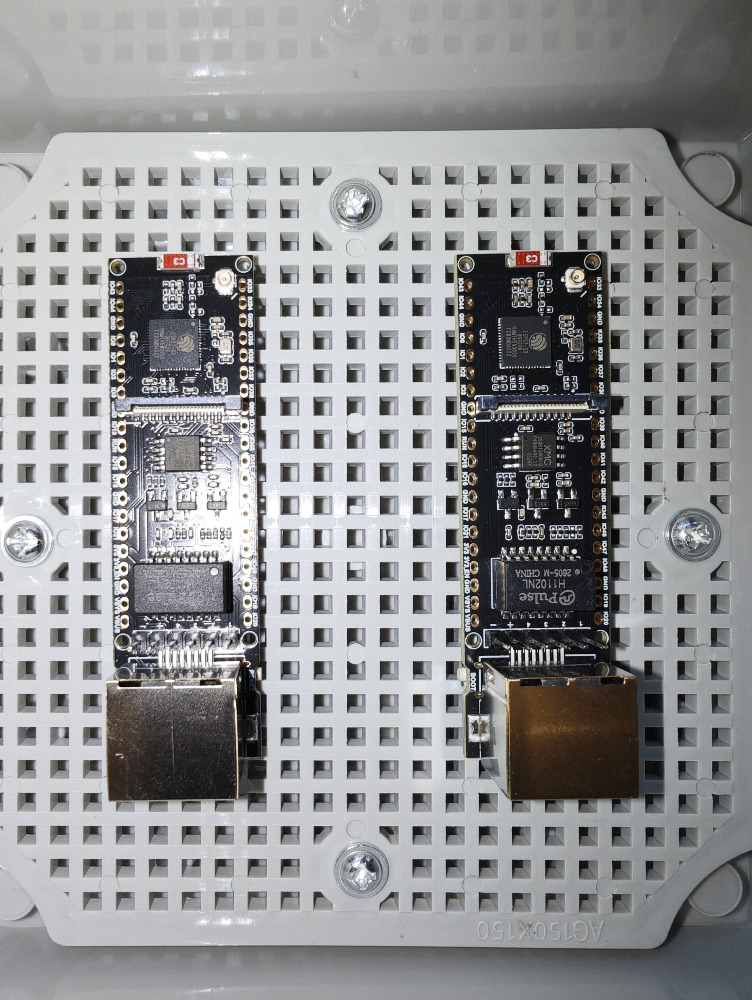
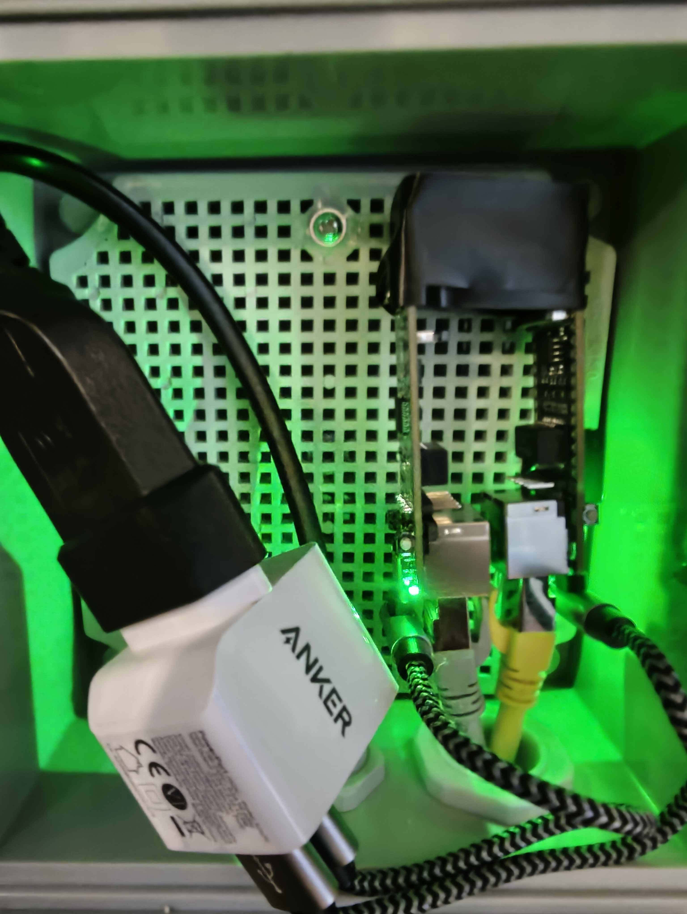

# Zendure SolarFlow 2400 Pro — lokale Regelung (ESP32-S3 + W5500)

Lokaler, cloud-freier Regelkreis für Nulleinspeisung mit **Shelly Pro 3EM** +
**Zendure SolarFlow 2400 Pro**, getrennt in zwei kleine, kabelgebundene Geräte.

## Architektur (getrennte Fehlerdomänen)

*Alle Teilnehmer im selben LAN: **Regler + Broker kabelgebunden** (Ethernet/W5500),
**Shelly + Zendure per WLAN**. Alle MQTT-Pfade treffen sich am Broker; der Regler schließt
den Kreis: Shelly → Regler → Broker → Zendure → zurück.*

- **regler/** — liest Shelly-Netzleistung, rechnet Sollwert, published per MQTT → Zendure; empfängt Telemetrie; Fail-Safe.
- **mqtt_broker/** — zentraler, **anonymer** MQTT-Broker (Zendure nutzt ein unbekanntes hartes Passwort → anonym nötig). Braucht eine **stabile IP** (DHCP-Reservierung im Router empfohlen; Regler + Zendure zeigen darauf).
- **Server / Logger** *(optional, separat)* — eigene Daten-/Logging-Domäne (abonniert den Broker, schreibt mit). Reboot dort stört die Regelung nicht.
- **Wächter** *(read-only, separat)* — unabhängiger Kreuzvergleich/Alarm (Doer vs. Checker).

## Hardware

*Im Dauerbetrieb: Broker (.110) und Regler (.114) kompakt in einer belüfteten Elektro-Box im Keller, beide kabelgebunden am lokalen LAN — stabile, jitterarme Regelschleife ohne WLAN-Abhängigkeit. Versorgung über ein Anker-2,4-A-Netzteil, das damit weit unter Volllast läuft (gut für 24/7).*

- 2× **Waveshare ESP32-S3-ETH** ([Produkt-Wiki](https://www.waveshare.com/wiki/ESP32-S3-ETH)) — ESP32-S3R8 + onboard **W5500**, **10/100 Mbps RJ45**-Ethernet-Port, kabelgebunden — **kein WLAN, kein Display**.
- 1× identisches Board als **Kalt-Ersatz** (dual-rollen-fähig: Regler- *oder* Broker-Ersatz).
- **W5500-SPI-Pins** (dieses Board): SCK 13 · MISO 12 · MOSI 11 · CS 14 · IRQ 10 · RST 9. *(Andere Belegung als die Variante ESP32-S3-ETH-8DI-8RO — im Sketch ggf. anpassen.)*

## Bibliotheken
*(W5500 läuft über das **core-eigene `ETH.h`** — die WIZnet-`Ethernet`-Lib wird NICHT benutzt; ihr `EthernetServer` ist auf ESP32 abstrakt/nicht instanziierbar.)*
- **regler:** PubSubClient *(oder drop-in Fork „PubSubClient3", +QoS)*, ArduinoJson (≥7) · ETH/SPI/WiFi aus dem Core
- **mqtt_broker:** PicoMQTT · ETH/SPI/WiFi aus dem Core (PicoMQTT-Default-`WiFiServer` läuft transparent über ETH)

## Board-Einstellungen (Arduino IDE)
- **Chip:** ESP32-S3R8 (Dual-Core Xtensa LX7, 8 MB Octal-PSRAM) auf dem Waveshare ESP32-S3-ETH. Board in der IDE: **`ESP32S3 Dev Module`**.
- **Core:** *esp32* by Espressif Systems — getestet mit **3.3.10** (jede aktuelle 3.x mit `ETH.h`/W5500 sollte laufen). Die headless Steuer-Geräte brauchen **nicht** das 2.0.x der Display-Wächter — die bleiben separat darauf.

**Tools-Menü** — die kritischen Einstellungen (der Rest kann auf Default bleiben):

| Einstellung | Wert | Warum |
|---|---|---|
| **PSRAM** | **`OPI PSRAM`** | ⚠️ muss zum S3**R8** (Octal-PSRAM) passen — falsch gesetzt bootet das Board nicht sauber |
| **Partition Scheme** | **`Huge APP (3MB No OTA / 1MB SPIFFS)`** | Platz für den Sketch; OTA auf diesen Geräten nicht nötig |
| Flash Size | `4MB (32Mb)` | Modul-Vorgabe (passt zum Huge-APP-Schema) |
| Flash Mode | `QIO 80MHz` | Standard für dieses Modul |
| CPU Frequency | `240MHz (WiFi)` | volle Leistung |
| Arduino Runs On / Events Run On | `Core 1` | |
| Upload Speed | `921600` | |
| Upload Mode | `UART0 / Hardware CDC` | |
| USB Mode | `Hardware CDC and JTAG` | |

- **W5500-SPI-Pins im Sketch an dein Board anpassen.** Tipp: zuerst das mitgelieferte Beispiel *File → Beispiele → ETH → ETH_W5500* auf dem Board verifizieren (IP per Ethernet), dann passt die `ETH.begin()`-Zeile sicher.

## Einrichtung
1. **Secrets anlegen** (beide sind `.gitignore't`, nie einchecken):
   - `regler/arduino_secrets.example.h` → `regler/arduino_secrets.h` — Broker-IP, Shelly-IP, Zendure-SN.
   - `mqtt_broker/arduino_secrets.example.h` → `mqtt_broker/arduino_secrets.h` — Zendure-SN (`ZEN_DEV`, Topic-Präfix).
2. Broker zuerst flashen (läuft per **DHCP**). Serial Monitor zeigt **IP + MAC** →
   im **Router** **genau diese vergebene IP** für die MAC **reservieren** (statisch binden).
   *Trick:* die per DHCP zugeteilte IP war in dem Moment frei — du reservierst also einfach
   genau die, **kein Vorab-Suchen nach einer freien IP nötig**. Ab dann ist sie fest dem
   Broker zugeordnet und kann an andere Geräte weitergegeben werden:
   eintragen in **(a)** Regler `arduino_secrets.h` (`SECRET_BROKER_HOST`) und **(b)** die Zendure-App.
   *(Alternative: feste IP im Broker-Code, siehe `ETH.config()`.)*
3. Zendure-App: **„Add to HEMS" → disable**, dann **Device Settings → MQTT** → reservierte Broker-IP eintragen (anonym).
   Falls die App keine eigene Broker-IP zulässt: `solarflow-bt-manager` (BT, s. u.) oder ein DNS-Relay.

### Board tauschen (Update vs. Defekt) — IP-Handover beachten
- **Firmware-Update an einem vorhandenen Board:** einfach neu flashen — **MAC bleibt, IP bleibt**, nichts am Router. (Immer *dasselbe* Board flashen, nicht ein Ersatz-Board für ein Update nehmen.)
- **Defekt-Tausch gegen ein Ersatz-Board:** das neue Board hat eine **andere MAC** → die DHCP-Reservierung im Router passt nicht mehr:
  - **Broker-Ersatz** (kritisch): die reservierte Broker-IP im Router auf die **neue MAC** umtragen — der Broker **muss** seine feste IP behalten (Regler *und* Zendure zeigen darauf). Alternativ feste IP im Broker-Code (`ETH.config()`).
  - **Regler-Ersatz** (unkritisch): Regler ist DHCP-Client, kennt nur die Broker-IP → einfach flashen.
  - Der Serial-Monitor zeigt beim Boot **IP + MAC** → genau diese MAC im Router eintragen.

## Status
**Funktionsfähig und im scharfen Betrieb getestet** — bidirektionale Nulleinspeisung, lokal, cloud-frei.

**Regler (`regler/`)**
- **Bidirektional**: entlädt bei Netz-Bezug, lädt bei PV-Überschuss (signierter Sollwert, Ziel ~0 W am Netzanschluss).
- **PI-Regler** (bewusst ohne D) mit Anti-Windup (Integrator *ist* der geklemmte Stellwert), Slew-Begrenzung, Totband.
- **Netz-Tiefpass** („Ruhe"): regelt den Mittelwert, statt schnell taktende Lasten zu jagen (die die ~10 s Aktuator-Totzeit ohnehin nicht trackt).
- **Fail-Safe (L1)**: Staleness-Guards (Netzdaten + Geräte-Kontakt), SoC-Floor gegen Tiefentladung, SoC-Decke, HW-Watchdog. Liveness über das **Kommando-Echo** des Geräts (die Zendure-Sensor-Telemetrie kommt lokal nur alle 2–3 min — als Frische-Signal untauglich).
- **Schneller Feed-in-Schutz** auf dem *rohen* Netzsignal (Gegenrichtungs-Abbruch bei echtem Last-Wegfall).

**Broker (`mqtt_broker/`)**
- Anonymer PicoMQTT-Broker + **Enforcer (L2)**: idlet das Gerät aktiv, wenn der Regler-Heartbeat ausbleibt.
- **Gate g — unabhängiger Endwert-Monitor (Gatekeeper):** der Regler stellt nur *Anträge* (`regler/cmd/*`), der Broker validiert jeden gegen **absolute Geräte-Physik** (Bereich, nie negativ, SoC-Floor) und ist **einziger Schreiber ans Gerät**; ein **Override-Watchdog** fängt zusätzlich Direkt-Publishes *am Gate vorbei* ab (fehlerhafter Regler / Fremdgerät → Safe). Auf getrennter MCU → deckt Regler-Fehler (RAM/ROM/Logik) *und* Fremd-Publish, **unabhängig von Regler-Updates**. Doer/Checker getrennt.

Beide bieten eine read-only **`GET /status`**-API (Port 80, JSON) für Diagnose/Baseline.

**Offen / in Arbeit:** externe Alarmierung (**L3**) bei Trip/Regler-Stumm — die letzte Voraussetzung für *unbeaufsichtigten* Dauerbetrieb.

## Grenzen anpassen (Konfiguration)

Die Werte, die man am ehesten an die eigene Anlage anpasst (Akkugröße, Einspeise-Politik, Reserve) — alle als `const` in **`regler/regler.ino`**, Änderung per **Neu-Flashen** (bewusst compile-zeit-fest, nicht zur Laufzeit verstellbar):

| Konstante | Default | Bedeutung |
|---|---|---|
| `TARGET_GRID_W` | −25 | Ziel-Netzleistung [W] (negativ = leichter Bezug; −25 vermeidet Einspeisung sicher) |
| `ZEN_MAX_W` | 2400 | max. **Entlade**-Leistung [W] (Geräte-Maximum) |
| `ZEN_CHARGE_MAX_W` | 2400 | max. **Lade**-Leistung [W] |
| `SOC_STOP_DISCHARGE` | 30 | SoC-**Floor** [%] — darunter kein Entladen (Tiefentlade-Schutz) |
| `SOC_STOP_CHARGE` | 98 | SoC-**Decke** [%] — darüber kein Laden |
| `SOC_RESUME_HYST` | 3 | Hysterese [%] (Freigabe erst ab Floor+Hyst bzw. Decke−Hyst) |
| `DEV_MINSOC` | 30 | zusätzlich an die Zendure gesendeter `minSoc`-Backstop (geräteseitig) |

Der Regel-Kern (`KI_REGLER`, `GRID_FILT_TAU_S`, `SLEW_*`, `RETREAT_RAW_W`) ist **Regelungs-Tuning** — normalerweise nicht anzufassen.

> ✅ **Gate g (unabhängiger Broker-Monitor, implementiert):** die **absoluten Backstop-Grenzen** `DEV_MAX_W` und
> `MON_SOC_FLOOR` liegen in **`mqtt_broker/mqtt_broker.ino`**. Es gilt die **Bracket-Regel: die Broker-Grenzen müssen
> die Regler-Grenzen einrahmen** (Broker weiter/absoluter: `DEV_MAX_W ≥ ZEN_MAX_W`, `MON_SOC_FLOOR ≤ SOC_STOP_DISCHARGE`).
> Wer eine Regler-Grenze *über* die Broker-Grenze hinaus ändert, muss die Broker-Grenze **mit-anpassen** — sonst
> greift der Monitor im Normalbetrieb (Dauer-Safe-State). SoC-Backstop **nie < 10 %**.

## Credits / Quellen

Dieses Projekt steht auf der Vorarbeit der Community. **Verwendeter Fremd-Code stammt
ausschließlich aus permissiv (MIT) lizenzierten Quellen.** Alle übrigen Projekte wurden
nur *studiert* (Ideen, Bibliotheks-Wahl, Stolpersteine, Protokoll/Topics) und in eigenem
Code umgesetzt — **kein Code übernommen**. (Lizenzen der eingebundenen Bibliotheken: siehe unten.)

**Verwendete Bibliotheken (eingebunden):**
- [PubSubClient](https://github.com/knolleary/pubsubclient) — MIT — MQTT-Client (Regler)
- [ArduinoJson](https://github.com/bblanchon/ArduinoJson) — MIT — JSON
- `ETH.h` / `WiFi.h` / `SPI.h` — **im esp32-Core 3.x enthalten** (W5500-SPI nativ; keine externe Ethernet-Lib)
- [PicoMQTT](https://github.com/mlesniew/PicoMQTT) — LGPL-3.0 — Broker (als *unveränderte* Library eingebunden)

**Code-Vorlagen (MIT — ggf. adaptiert, mit Dank):**
- [pidow/Zendure-ESP32-2432S024C](https://github.com/pidow/Zendure-ESP32-2432S024C) — MIT
- [surfer1264/Zendure-Stuff](https://github.com/surfer1264/Zendure-Stuff) — MIT

**Studierte Referenzen (nur Inspiration/Protokoll — KEIN Code übernommen):**
- [reinhard-brandstaedter/solarflow-control](https://github.com/reinhard-brandstaedter/solarflow-control) — Regel-Strategie Nulleinspeisung
- [reinhard-brandstaedter/solarflow-bt-manager](https://github.com/reinhard-brandstaedter/solarflow-bt-manager) — Zendure lokal an eigenen Broker zeigen
- [Zendure/zenSDK](https://github.com/Zendure/zenSDK) — offizielle Topics/Kommandos
- [hoylabs/OpenDTU-OnBattery](https://github.com/hoylabs/OpenDTU-OnBattery) — GPL-2.0 — Architektur/Integration studiert, **kein Code übernommen**

Danke an alle Autoren. 🙏  Wer hier ohne explizite Lizenz gelistet ist: eine MIT-Ergänzung wäre herzlich willkommen.

## Lizenz
Dieses Projekt: **MIT** (wie die Schwester-Repos esp32-/gigar1-shelly-zendure-monitor) — sauber gehalten durch obige Trennung.

## ⚠️ Disclaimer
Schreibt aktiv an den Zendure. Vor scharfem Betrieb: **Zendure-Safe-State testen**
(was tut der Akku, wenn Sollwerte ausbleiben?) und Fail-Safe verifizieren.
